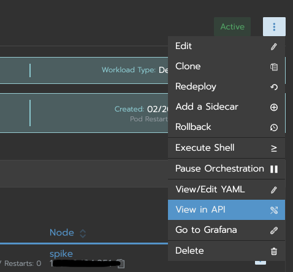
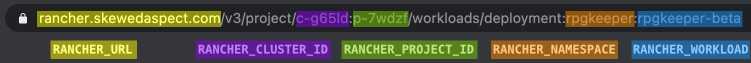
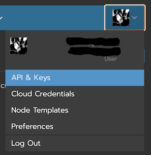
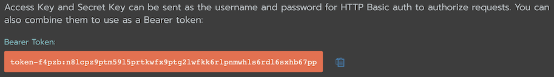

# Rancher v2 Workload Redeploy

This action is heavily inspired by [th0th/rancher-redeploy-workload][]. Unfortunately, it wouldn't work on my 
rancher install, but recreating it in Node.JS was trivial, and it just seems to work. I also added the ability to 
replace the image tag currently being deployed, since I have a use case for that. Huge props to that project for the 
methodology and inspiration.

[th0th/rancher-redeploy-workload]: https://github.com/th0th/rancher-redeploy-workload

## Basic Usage

_Note: You will need to have created the workload first, as this action only redeploys it, it doesn't create the 
workload itself._

### Environment Variables

* `RANCHER_BEARER_TOKEN` - A bearer api token for authorization.
* `RANCHER_CLUSTER_ID` - The `c-XXXXX` identifier of the cluster this workload is part of.
* `RANCHER_NAMESPACE` - The name of the namespace this workload is part of.
* `RANCHER_PROJECT_ID` - The `p-XXXXX` identifier of the project this workload is part of.
* `RANCHER_URL` - The base url of your rancher instance.
* `RANCHER_WORKLOAD` - The name of the workload you're going to redeploy.
* `IMAGE_TAG` - (optional) A new docker tag to deploy for the workload, i.e. `v1.2.0`.

#### How to get (most) of the values

You will need to grab some information to fill out the required environment variables. My recommendation is to open 
up the workload you want to redeploy, and then hit the three dots in the upper right, and select 'View in API':



This will load up a page full fo JSON. What we actually are looking for is the url; it contains the pieces we'll 
need for the environment variables. Here is how the parts of the url map to the environment variables:



Just use the values out of the url (as seen above) for the values of the environment variables.

#### Bearer Token

You will need to generate an API token to be able to authorize with the API. To do so, in rancher, click on your user 
icon in the upper right, and then go to 'API & Keys':



Click on 'Add Key'. Add a meaningful description, do not set an expiration, and most importantly **do not set a 
scope**. If you set a scope, you will get a `403 Not Authorized` error.

Once you do that, you will only have one opportunity to copy down the bearer token. It should look like this:



Copy that value (starting with `token-`) as the `RANCHER_BEARER_TOKEN`.

### Docker container

You can run this as a plain docker:

```bash
$ docker run --rm -it \
    -e RANCHER_BEARER_TOKEN="token-f4pzb:n81cpz9ptm5915prtkwfx9ptg21wfkk6r1pnmwh1s6rd16sxhb67pp" \
    -e RANCHER_CLUSTER_ID="c-kwbgu" \
    -e RANCHER_NAMESPACE="namespace" \
    -e RANCHER_PROJECT_ID="p-sk738f" \
    -e RANCHER_URL="https://rancher.example.com" \
    -e RANCHER_WORKLOAD="my-workload" \
    -e IMAGE_TAG="v1.2.0" \
    SkewedAspect/rancher-redeploy:latest
```

(Remember when copying this that `IMAGE_TAG` is optional, and you may not want to include it.)

### GitHub Action

```yaml
  - name: Update rancher deployment
    uses: SkewedAspect/rancher-redeploy@latest
    env:
      RANCHER_BEARER_TOKEN: ${{ secrets.RANCHER_BEARER_TOKEN }}
      RANCHER_CLUSTER_ID: 'c-kwbgu'
      RANCHER_NAMESPACE: 'namespace'
      RANCHER_PROJECT_ID: 'p-sk738f'
      RANCHER_URL: 'https://rancher.example.com'
      RANCHER_WORKLOAD: 'my-workload'
      IMAGE_TAG: 'v1.2.0'
```

(Remember when copying this that `IMAGE_TAG` is optional, and you may not want to include it.)

### GitLab

Since this is available as a docker image, you can easily plug it into your `gitlab-ci.yml`:

```yml
stages:
  - build
  - deploy
    
build docker:
    stage: build
    image: docker:latest
    services:
        - docker:dind
    variables:
        GIT_DEPTH: 1
    only:
        - /^v\d+\.\d+\.\d+.*/
    except:
        - branches
    script:
        - docker login -u gitlab-ci-token -p $CI_BUILD_TOKEN registry.gitlab.com
        - docker build -t registry.gitlab.com/example/my-workload:latest -t registry.gitlab.com/example/my-workload:$CI_BUILD_REF_NAME .
        - docker push registry.gitlab.com/example/my-workload:latest
        - docker push registry.gitlab.com/example/my-workload:$CI_BUILD_REF_NAME
    
deploy docker:
    stage: deploy
    image: SkewedAspect/rancher-deploy:latest
    only:
        - /^v\d+\.\d+\.\d+.*/
    except:
        - branches
    when: manual
    variables:
        RANCHER_BEARER_TOKEN="token-f4pzb:n81cpz9ptm5915prtkwfx9ptg21wfkk6r1pnmwh1s6rd16sxhb67pp"
        RANCHER_CLUSTER_ID="c-kwbgu"
        RANCHER_NAMESPACE="namespace"
        RANCHER_PROJECT_ID="p-sk738f"
        RANCHER_URL="https://rancher.example.com"
        RANCHER_WORKLOAD="my-workload"
        IMAGE_TAG="v1.2.0"
    # GitLab requires a script block
    script:
        - node ./deploy.js
```
